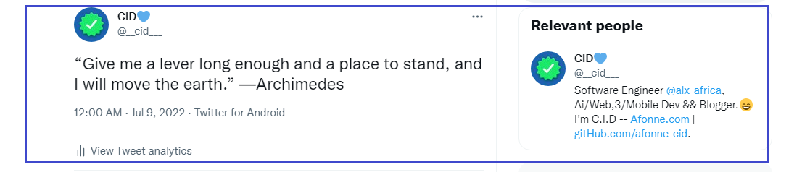

# <a href="https://gifted-jang-9534d2.netlify.app/" target="_blank">VIEW MY PORTFOLIO HERE</a>

<h1> Hello, My name is 'CID'  </h1>

  

- 🔭 I’m currently looking for a tech job for the post of a Junior Developer
  
...my biggest interest is in making life easier and businesses more profitable by solving problems, digitizing manual processes and automating daily mundane tasks in life and business with technology.

I have led a team of 4 (UI/UX Designer, Mobile Developer, Frontend Developer, and I, Backend Engineer) to a social payment hackerton organized by Credo where we made it to the finalist 10 out of tens of participating teams.

Interestingly, before delving into Software Engineering, all my 6 years of work experience have all been in Cyber-cafes and computer centers where I either work as a manager, an instructor, operator or do typesetting and graphics to clients.

I intend to solve problems and be part of solutions in a reputable organization by utilizing and leveraging this fundamental knowledge and experiences; the sign off, skills and certification from my Udacity Fullstack Developer + ALX-T scholarship course completion, the certification and endorsement from ALX Africa in a 15-months intensive project-based Software Engineering Programme as a Backend Engineer.

<h2> Skills  </h2>

<h2> Connect with me  </h2>
 
 
 
 

 

<h2> My GitHub Stats  </h2>

<h2> My Blog Posts </h2>

<!-- BLOG-POST-LIST:START -->
- [Insta Gain Followers Strategy: How to Gain More Followers On Instagram](https://afonne.com/insta-gain-followers-strategy-how-to-gain-more-followers-on-instagram/)
- [A Career In UI/UX after 30: Too Old?](https://afonne.com/a-career-in-ui-ux-after-30-tool-old/)
<!-- BLOG-POST-LIST:END -->

<h2> Some Programming Humor for you </h2>

 
<footer align='center'>README made with help of <a href='https://github.com/rahulbanerjee26/githubProfileReadmeGenerator'>githubProfileReadmeGenerator</a> </footer>
